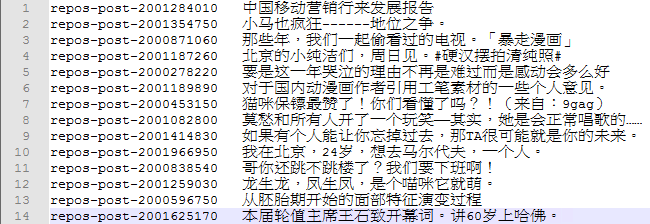
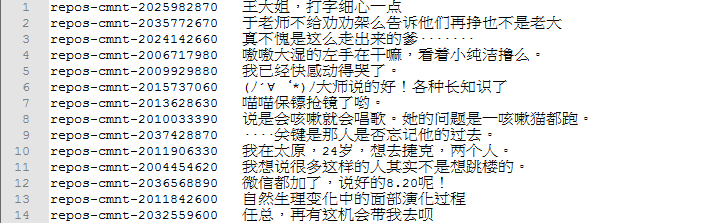
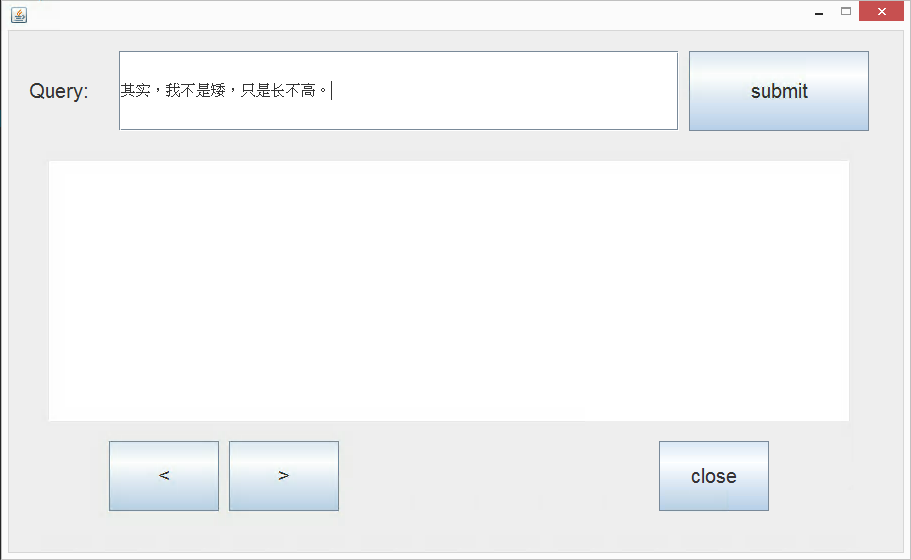
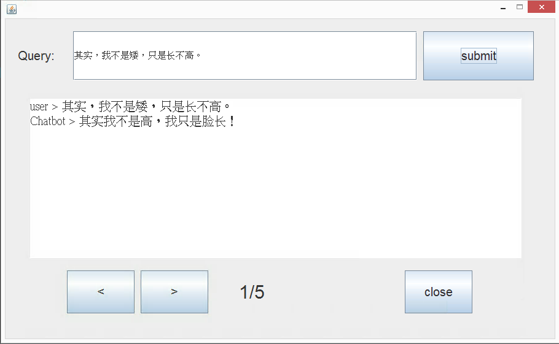
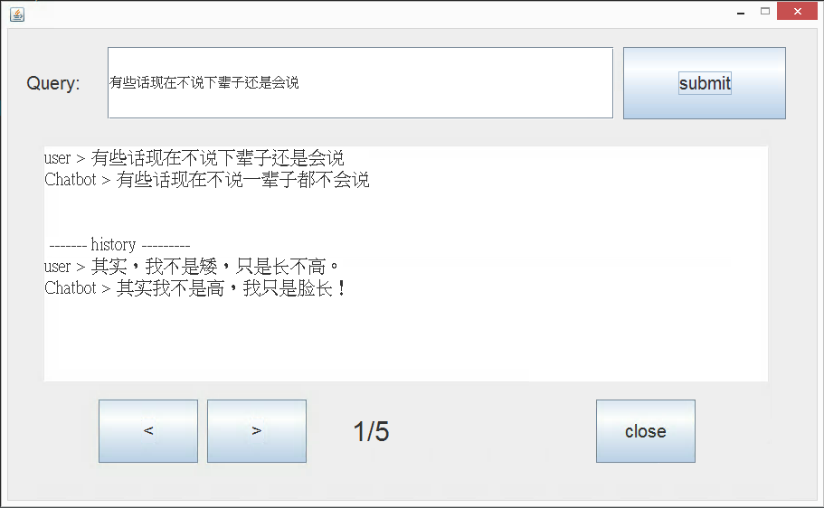

##### 系統背景
version: solr 4.3 OS: windows

# 1. 資料預處理及上傳至solr

## 啟動solr
在cmd輸入以下指令<br>
`cd "C:\Program Files\solr-6.2.1"`<br>
`bin\solr start`

##### 跑完後可以利用瀏覽器在網址的地方輸入`localhost:8983`便會看到solr的使用者介面

## 建立一個新的collection
在cmd輸入以下指令
`bin\solr create -c IEIR2`
##### Note : IEIR 為我取的collection name，此名稱可自由代換

## 將資料upload到solr中
#### 1.由於原始資料的格式並不是適合放入solr的格式，因此利用`inputxml.java`來進行輸入格式的轉換。

#### 下方為大略的程式碼解說
  - ##### 目標的輸入格式為一個post, comment的pair，我有保留原有的post,comment id，因此在xml中每個document將包含4個欄位（post_id post comment_id comment）
  - ##### 原始資料如下方圖片
  
  

  ```java
  while(br1.ready() && br2.ready()){
				String[] post = br1.readLine().split("\t");
				String[] comment = br2.readLine().split("\t");

				Element doc_tag = doc.createElement("doc");
				rootelement.appendChild(doc_tag);

				Element field_1 = doc.createElement("field");
				field_1.setAttribute("name", "post_id");
				field_1.appendChild(doc.createTextNode(post[0]));
				doc_tag.appendChild(field_1);

				Element field_2 = doc.createElement("field");
				field_2.setAttribute("name", "post");
				field_2.appendChild(doc.createTextNode(post[1]));
				doc_tag.appendChild(field_2);

				Element field_3 = doc.createElement("field");
				field_3.setAttribute("name", "comment");
				field_3.appendChild(doc.createTextNode(comment[1]));
				doc_tag.appendChild(field_3);

				Element field_4 = doc.createElement("field");
				field_4.setAttribute("name", "comment_id");
				field_4.appendChild(doc.createTextNode(comment[0]));
				doc_tag.appendChild(field_4);

			}
  ```
#### 2.在第一步驟完成後，將output的xml檔放入同directory下的data folder當中，再利用西錒方的指令將xml檔上傳至solr
`java -Dc="IEIR" -jar example\exampledocs\post.jar data\input.xml`
#### 上傳檔案後就可以去solr上看看是否有document存在

## 關閉solr
在cmd輸入以下指令<br>
`bin\solr stop -p 8983`

## 檢查solr 狀態
在cmd輸入以下指令<br>
`bin\solr status`

# 2. 在schema中加入簡體中文的tokenizer及在config中加入自定義的request handler
- ## 因為原本預設的tokenizer並不適用於簡體中文斷詞，因此需加入簡體中文的tokenizer並使用它
####  1. 下載lucene-analyzers-smartcn-6.2.0.jar並放到`C:\ProgramFiles\solr-6.4.1\server\solr-webapp\webapp\WEB-INF\lib`中
####  2. 以系統管理員身份對`C:\Program Files\solr-6.2.1\server\solr\IEIR2\conf\managed-schema.xml`檔案進行編輯
####  3. 將以下程式碼加入xml中，我將此tokenizer取名為sc(Simplified Chinese)
```
<fieldType name="text_sc" class="solr.TextField" positionIncrementGap="100">
    <analyzer>
      <tokenizer class="solr.HMMChineseTokenizerFactory"/>
      <filter class="solr.StopFilterFactory" words="org/apache/lucene/analysis/cn/smart/stopwords.txt"/>
      <filter class="solr.PorterStemFilterFactory"/>
    </analyzer>
</fieldType>```

  ####  4. 將包含文字的post及comment欄位的type從string改為text_sc

  `<field name="post" type="text_sc"/>`<br>
  `<field name="comment" type="text_sc"/>`

- ## 因爲原本預設的request handler為/select且我希望更改其算分方式，因此新建立一個request handler叫/dismax且自定義score的計算方式

  #### 1.到`C:\Program Files\solr-6.2.1\server\solr\IEIR2\conf\solrconfig.xml`進行修改
  #### 2.將下方程式碼加入檔案中
  ```XML
  <requestHandler name="/dismax" class="solr.SearchHandler" default="true">
    <lst name="defaults">
      <str name="echoParams">explicit</str>
      <str name="defType">dismax</str>
      <str name="q.alt">*:*</str>
        <str name="qf">
          post^3 post_id^0.1 comment^6 comment_id^0.1
        </str>
      <str name="rows">5</str>
      <str name="fl">comment,score</str>
    </lst>
  </requestHandler>
      ```
###### note: 其中qf 的部分我對個別得類別的weight進行調整，根據我的weight，query與comment的相似會相較於對post相似得到較高的分數，然後最後在row的地方我是設定回傳5個document，fl的話是指只顯示回傳document中的comment及score的內容

# 3. 利用solrJ來從solr retrieve document

## 為了方便使用因此利用java寫了簡單的gui來進行query及查看得到的response(SolrJ.java)
#### 主要連線到solr即進行連線的程式碼如下
```java
public static void SolrQuery() throws SolrServerException, IOException{
		String urlString = "http://localhost:8983/solr/IEIR_2";
		SolrClient solr = new HttpSolrClient.Builder(urlString).build();
		SolrQuery query = new SolrQuery();
		query.set("qt", "/dismax");
		query.setQuery(queryString);
		System.out.println("queryString is : " + queryString);
		QueryResponse response = solr.query(query);
		list = response.getResults();
		for(SolrDocument d:list){
			System.out.println(d);
		}
	}
```

#### 下方為介面簡單操作說明
> #### 在query欄位中輸入要進行的query

> #### 按下submit

> #### 再打入第二個query

> #### 點選下方的按鈕進行retrieve的前五名response的查看

> #### 按下close按鈕來結束程式
