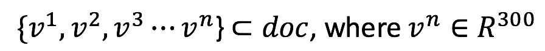
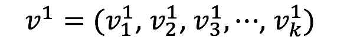
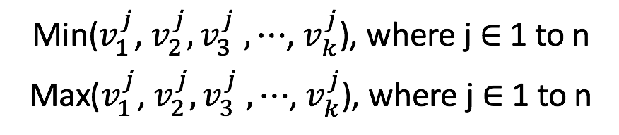
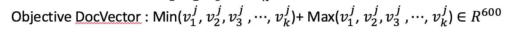

### Assignment2 improving chatbot with Word-Embedding and SVM-Rank

#### Building word-Embedding model in R
```R
library(jiebaR)
library(readr)
library(wordVectors)

cutter = worker("hmm", stop_word = "stop_words.utf8", hmm="hmm_model.utf8", bylines = T)
# corpus.txt是ntcir提供的post, comment的文字內容
text = read_file("corpus.txt")
article_words = segment(text, cutter)
article_word_vectors = sapply(article_words, paste, collapse = " ")
writeLines(article_word_vectors, "corpus_vec.txt")
model_SKIP = train_word2vec("corpus_vec.txt", output="skip_gram.bin", threads = 3, vectors=300, window = 7, force = T, min_count = 7)
# 此csv檔為每個詞所對應的vector的table
write.csv(model_SKIP,"skip_gram.csv")
```
#### Store word-embedding model trained in R to HashMap in Java
```java
public static HashMap<Object, ArrayList<Double>> wordVecDict = new HashMap<Object, ArrayList<Double>>();
public static void main(String[] args){
  try {			
			BufferedReader br = new BufferedReader(new FileReader("C:\\Users\\joy\\Desktop\\IEIR\\modelSC.csv"));
			for(int i =0; i<2; i++){
				br.readLine();
			}

			while(br.ready()) {

				ArrayList<Double> vector = new ArrayList<Double>();
				String[] s = br.readLine().split(",");
				for(int i=1; i<s.length; i++){
					vector.add(Double.parseDouble(s[i]));
				}
				wordVecDict.put(s[0].replaceAll("\"", ""),vector);
				System.out.println(wordVecDict.size());


			}
			br.close();
}
```

#### Convert wordVector to docVector
- #### 概念：document vector 就是取出每個維度最小及最大的元素來分別組成兩個同樣為300維的vector





```Java
public double[] docToVec(String document){
		double[] docVec = new double[600];
		String[] inputToken = document.split(" ");
		Boolean first = true;
		for(int i=0; i<inputToken.length; i++){
			ArrayList<Double> wordVec = wordVecDict.get(inputToken[i]);
			if(wordVec != null && first == true){
				for(int j=0; j<wordVec.size(); j++){
					docVec[j] = wordVec.get(j);
					docVec[j+300] = wordVec.get(j);
				}
				first = false;
			}else if(wordVec != null && first == false){
				for(int j=0; j<wordVec.size(); j++){
					if(wordVec.get(j)<docVec[j]){
						docVec[j] = wordVec.get(j);
					}else{
						docVec[j+300] = wordVec.get(j);
					}
				}
			}else
				continue;
		}
		return docVec;
	}

```

#### Calculate cosine Similarity between Documents

```java
public String cosineSimilarity(double[] query, double[] doc){
		DecimalFormat df = new DecimalFormat("#.########");
		double dotProduct = 0,queryNorm =0, docNorm =0, cosSimilarity=0;
		for(int i=0; i<query.length; i++){
			queryNorm += Math.pow(query[i],2);
			docNorm += Math.pow(doc[i], 2);
			dotProduct += query[i]*doc[i];
		}
		System.out.println("dotProduct : " + dotProduct);
		System.out.println("queryNorm : " + queryNorm);
		System.out.println("docNorm : " + docNorm);
		cosSimilarity = dotProduct/ (Math.sqrt(queryNorm)*Math.sqrt(docNorm));
		return df.format(cosSimilarity);
	}

```
#### Feature for SVM-Rank
- Query DocVector(dim: 600)
- Comment DocVector(dim: 600)
- Cosine Similarity value of query and comment
